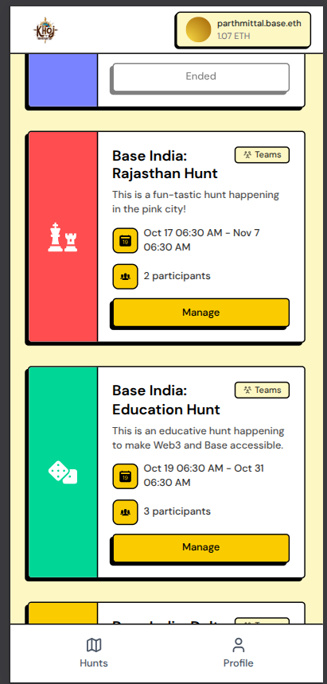

<div align="center">

<h1 align="center">Khoj</h1>
</div>

Khoj (meaning "search" or "discovery" in Hindi) is a geo-location based treasure hunt platform that combines real-world exploration with Web3 technology. Users can participate in location-based treasure hunts where they solve riddles, visit physical locations, and earn onchain rewards. Discover a new way to onboard users to Web3 with a Web2-native experience.


- **🔗 [playkhoj.com](https://playkhoj.com)**
- **✨ [Product Guide](https://github.com/mittal-parth/Khoj/wiki/Product-Guide)**
- **📝 [Wiki](https://github.com/mittal-parth/Khoj/wiki)**

## Screenshots

<table align="center">
  <tr>
    <td align="center">
      
      <br>
      <sub><i>Hunts list</i></sub>
    </td>
    <td align="center">
      
      <br>
      <sub><i>Hunt details</i></sub>
    </td>
    <td align="center">
      
      <br>
      <sub><i>Creating a team</i></sub>
    </td>
    <td align="center">
      
      <br>
      <sub><i>Team invite code & QR</i></sub>
    </td>
  </tr>
  <tr>
    <td align="center">
      
      <br>
      <sub><i>Join team</i></sub>
    </td>
    <td align="center">
      
      <br>
      <sub><i>Team details</i></sub>
    </td>
    <td align="center">
      
      <br>
      <sub><i>Clue</i></sub>
    </td>
    <td align="center">
      
      <br>
      <sub><i>Hunt end</i></sub>
    </td>
  </tr>
</table>

## Architecture Diagram

<div align="center">
  
  <br>
  <sub><i>Khoj System Architecture and Flow Diagram</i></sub>
  <br><br>
  
  <br>
  <sub><i>Hunt Creation Flow Diagram</i></sub>
</div>


## ✨ Key Features

### Core Gameplay
- **Progressive Riddles**: Each hunt consists of multiple interconnected clues that tell a story. 
- **Location-Based Verification**: The answer to each clue is a physical location.
- **Personalised Clues**: The clues are tailored to the user's taste using AI while still keeping the answer same.
- **Team based gameplay**: Players can form teams and invite other players to join.
- **Multiple Attempts**: Players get 3 attempts per clue to verify their location
- **Real-time Collaboration**: Built-in video chat for team coordination.
- **Rewards & Reputation**: Fastest players win rewards based on a reputation score generated which can be redeemed later.


## 📦 Application Architecture

### Frontend (`/frontend`)
- **Framework**: React 18 with TypeScript, Vite build system
- **Web3**: Thirdweb SDK v5, Wagmi, Viem for blockchain interactions
- **UI**: TailwindCSS, Radix UI primitives, Framer Motion animations
- **Key dependencies**: Huddle01 React, Leaflet maps, React Router

### Backend (`/backend`)
- **Framework**: Express.js with ES modules
- **Web3 Services**: Lit Protocol client, Huddle01 server SDK, Pinata IPFS, Sign Protocol for attestations
- **Key files**: `server.js` (main server), `huddle.js` (video), `pinata.js` (storage)
- **APIs**: Location verification, file uploads, video room management

### Smart Contracts (`/contracts`)
- **Framework**: Hardhat with OpenZeppelin contracts  
- **Contracts**: `Khoj.sol` (main hunt contract), `KhojNFT.sol` (NFT rewards)
- **Testing**: Comprehensive test suite in `/test/Khoj.test.js`
- **Deployment**: Multi-chain support (Moonbeam, PassetHub and Base)

```
/frontend/          - React/TypeScript Web3 frontend
  /src/components/ - React components (Clue.tsx, HuntDetails.tsx key files)
  package.json     - Frontend dependencies and scripts
/backend/          - Express.js Web3 backend
  server.js        - Main server with Lit Protocol integration
  package.json     - Backend dependencies  
/contracts/        - Hardhat smart contracts
  /src/            - Solidity contracts (Khoj.sol, KhojNFT.sol)
  /test/           - Contract test suite
  package.json     - Contract build and test scripts
```


## 🚀 Installation Instructions

1. Fork and Clone the repository:
```bash
git clone https://github.com/yourusername/Khoj.git
```


### Initial Setup Commands

```bash
# Install dependencies
cd frontend && npm install  # Takes ~90 seconds
cd ../backend && npm install  # Takes ~25 seconds  
cd ../contracts && npm install  # Takes ~15 seconds
```

### Environment Setup

Follow this detailed guide in the Wiki to setup all the environment variables.

[How to obtain env variables](https://github.com/mittal-parth/Khoj/wiki/How-to-obtain-env-variables-%F0%9F%A7%B0)

### Running the Application

After completing the setup, you can run each component:

1. **Backend Server**:
   ```bash
   cd backend
   npm start
   ```
   The backend server will be available at `http://localhost:8000`

2. **Frontend Development Server**:
   ```bash
   cd frontend
   npm run dev
   ```
   The frontend will be available at `http://localhost:5173`

3. **Smart Contracts Testing**:
   ```bash
   cd contracts
   npx hardhat test
   ```
   For more detailed contract testing options, refer to the [contracts README](/contracts/README.md)


## 👥 Team

- [Abhiraj Mengade](https://github.com/abhiraj-mengade)
- [Ayush Kumar Singh](https://github.com/ayush4345)
- [Mardav Gandhi](https://github.com/marcdhi)
- [Parth Mittal](https://github.com/mittal-parth)
- [Shubham Rasal](https://github.com/Shubham-Rasal)


Built with ❤️ by Team Khoj!
